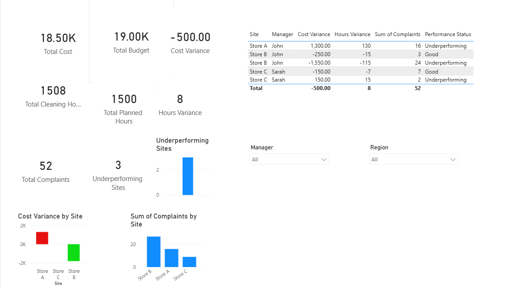

# 📊 Multi-Site Operations Performance Dashboard

## 🚀 Overview
This project presents an interactive **Power BI dashboard** designed to analyze and monitor operational performance across multiple sites. It focuses on key business areas such as **cost efficiency, staffing utilization, and service quality**, enabling data-driven decision-making for operations managers.

---

## 🎯 Objectives
The dashboard helps answer critical business questions:
- Which sites are **over or under budget**?
- Are sites **properly staffed** based on planned vs actual hours?
- Which locations have **high customer complaints**?
- Which sites are **underperforming overall**?

---

## 📁 Dataset Description
The dataset represents multi-site operational data with the following fields:

- Date  
- Site  
- Region  
- Manager  
- Cleaning Hours (Actual)  
- Planned Hours  
- Cost  
- Budget  
- Complaints  

---

## 🧹 Data Preparation (Power Query)
- Fixed column headers and data types  
- Handled missing values and validated data quality  
- Removed duplicates based on business keys  
- Standardized text fields (Site, Region, Manager)  
- Created time-based features (Month Name, Month Number)  

---

## 🧮 DAX Measures Created

### Core Metrics
- **Total Cost**  
- **Total Budget**  
- **Total Complaints**  
- **Total Cleaning Hours**  
- **Total Planned Hours**

### Performance Metrics
- **Cost Variance** = Total Cost - Total Budget  
- **Hours Variance** = Cleaning Hours - Planned Hours  
- **Underperforming Sites** (based on cost and complaints logic)

---

## 📊 Dashboard Features

### 🧩 KPI Cards (Executive Summary)
- Total Cost  
- Cost Variance  
- Total Complaints  
- Underperforming Sites  

---

### 📉 Visualizations
- **Cost Variance by Site**  
  - Highlights overspending vs savings  
  - Conditional formatting (Red = bad, Green = good)

- **Complaints by Site**  
  - Identifies service quality issues  

---

### 📋 Detailed Table
Provides a breakdown by:
- Site  
- Manager  
- Cost Variance  
- Hours Variance  
- Complaints  
- Performance Status  

---

### 🎛️ Interactivity
- **Dropdown slicers** for:
  - Manager  
  - Region  

Enables users to filter and focus on specific areas of responsibility.

---

## 🧠 Key Insights

- Some sites are **under budget but have high complaints**, indicating potential understaffing or service quality issues  
- Certain sites are **overspending without improving performance**, highlighting inefficiencies  
- Balanced sites achieve **optimal cost and low complaints**, representing best practices  

---

## 💡 Business Impact
This dashboard enables:
- Faster identification of **underperforming sites**  
- Better **resource allocation decisions**  
- Improved **service quality monitoring**  
- Data-driven **manager accountability**

---

## 🛠️ Tools & Technologies
- Power BI Desktop  
- Power Query (Data Transformation)  
- DAX (Data Analysis Expressions)  

---

## 📌 Skills Demonstrated
- Data Cleaning & Validation  
- Data Modeling  
- DAX Measure Development  
- Data Visualization & Dashboard Design  
- Business Analysis & Insight Generation  

---

## 📷 Dashboard Preview
_Add screenshots here_

---

## 🚀 How to Use
1. Download the `.pbix` file  
2. Open in Power BI Desktop  
3. Interact with slicers to explore insights  

---

## 📣 Future Improvements
- Add time-series trend analysis  
- Implement alerts for high complaints  
- Enhance performance scoring logic  
- Integrate real-time data sources  

---

## 🤝 Contribution
Feel free to fork this repository and enhance the dashboard with additional features or datasets.

---

## 📬 Contact
For any questions or suggestions, feel free to connect.
